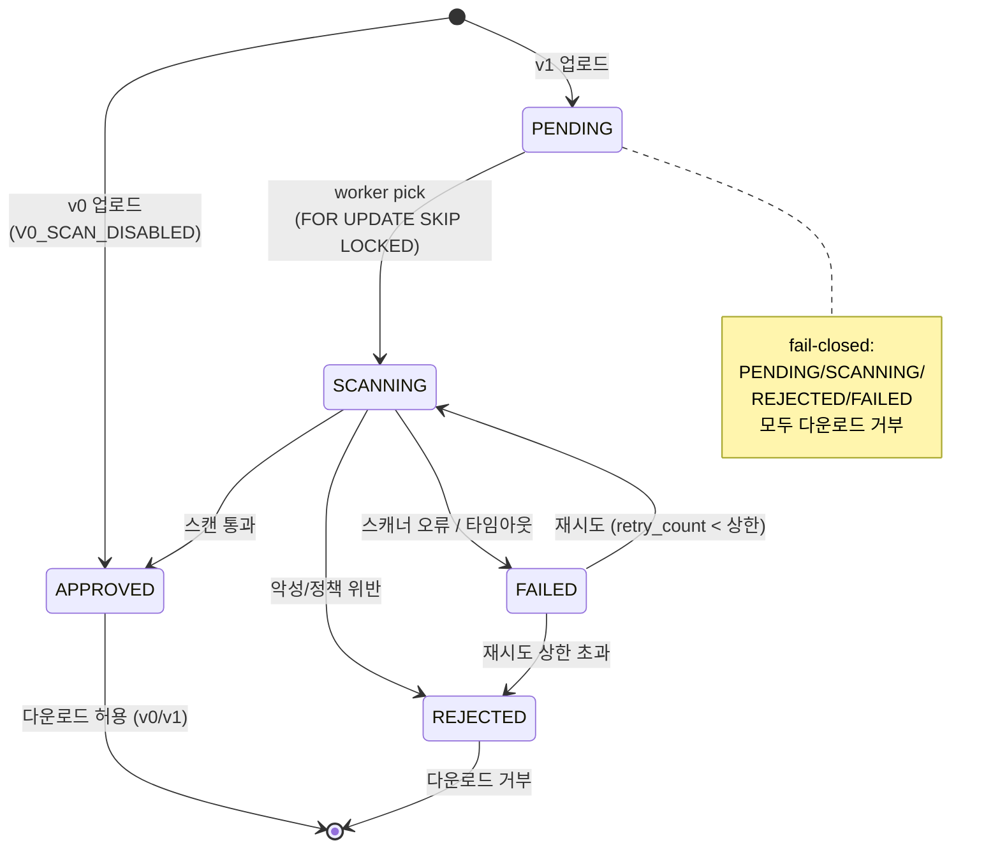
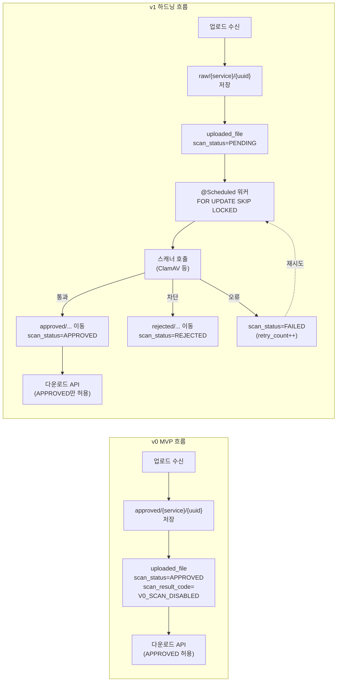

# ARCHITECTURE.md

# hardened-groupware-template 아키텍처 문서

## 1. 문서 목적

본 문서는 `hardened-groupware-template`의 시스템 구조, 서비스 경계, 데이터 소유권, 파일 라이프사이클, 서비스 간 통신 원칙을 정의한다.
기획 문서(`PLANNING.md`)의 방향을 구현 가능한 구조로 고정하는 정본 문서다.

핵심 질문:

- 시스템은 어떤 계층으로 나뉘는가
- external/internal 경계는 어떻게 강제되는가
- 데이터와 파일은 어디에 저장되는가
- 파일 상태(`uploaded_file.scan_status`)는 어떻게 관리되는가
- v0와 v1의 차이는 어디에서 발생하는가

---

## 2. 문서 읽기 가이드

중복 설명을 줄이기 위해 본 문서는 섹션별 정본 역할을 고정한다.

- 계층/서비스 경계/토폴로지: 섹션 4
- 파일 상태 머신과 v0/v1 흐름: 섹션 5
- 인증/권한/서비스 간 통신: 섹션 6, 7, 8
- 저장소 구조 대응: 섹션 9

---

## 3. 설계 원칙

### 3.1 DMZ는 프록시/정적 서빙만 수행

DMZ는 외부 요청 수신, 정적 자산 서빙, Reverse Proxy만 수행한다.
비즈니스 로직과 DB 접근은 WAS에서만 처리한다.

### 3.2 external/internal을 서비스 경계로 분리

- `external-api`: 공개 사용자 도메인 처리
- `internal-api`: 임직원/관리자 도메인 처리

### 3.3 데이터 소유권 = DB 소유권

- `external_db` 소유자: `external-api`
- `internal_db` 소유자: `internal-api`

`internal-api`는 `external_db`에 직접 연결/조회/수정을 하지 않는다.
필요한 연계는 `external-api`의 internal 전용 API를 통해 수행한다.

### 3.4 파일은 "위치"가 아니라 "상태"로 통제

파일 보안 등급은 스토리지 물리 분리보다 `uploaded_file.scan_status` 상태 머신으로 관리한다.
스토리지 경로는 상태의 결과를 반영하는 표현 계층이다.

### 3.5 사용자 인증과 서비스 간 인증 분리

- 사용자 인증: 세션/쿠키 기반(JWT 미사용)
- 서비스 간 인증: 내부 전용 토큰/서비스 계정

### 3.6 fail-open 금지

파일 스캔/검증 실패 시 기본 동작은 차단(fail-closed)이다.

- 허용: `scan_status=APPROVED`
- 거부: `PENDING`, `SCANNING`, `REJECTED`, `FAILED`

---

## 4. 논리 계층 구조

## 4.1 DMZ / External Ingress Zone

구성 요소:

- `Nginx (external-proxy)`
- `external-web` 정적 자산
- `Nginx (internal-proxy)`
- `internal-web` 정적 자산

DMZ 금지 사항:

- DB 직접 접근
- 파일 스캔 로직 수행
- 내부 관리자 비즈니스 로직 실행

---

## 4.2 Application / WAS Zone

### 4.2.1 external-api

담당 기능:

- 회원가입/로그인/비밀번호 재설정
- 뉴스/공지/자료실/고객센터/채용
- 마이페이지/내역 조회
- 파일 업로드 수신 및 메타데이터 기록
- internal 전용 관리 API(internal-api가 호출하는 서비스 간 엔드포인트) 제공

### 4.2.2 internal-api

담당 기능:

- 임직원 로그인/세션
- RBAC
- 결재/공지/사원/지원자/문의 관리
- external 연계 모듈(서비스 간 호출)

제약:

- `external_db` 직접 접근 금지
- external 데이터 변경은 `external-api` 경유

### 4.2.3 파일 스캔 실행 모델

`v1`에서 적용하는 파일 스캔 실행 모델은 아래 카드 중 선택한다.

- `low`: 스캔 없음, 업로드 정책 검증만 수행
- `medium`: 스캔 없음, DB 상태 게이트만 수행
- `high`(권장): 각 서비스 owner가 자기 파일 스캔(`@Scheduled` 또는 배치)
- `high+alpha`(선택): 공유 스캔 워커

동시성 안전장치:

- 다중 인스턴스는 `FOR UPDATE SKIP LOCKED` 또는 동등 락 필수
- 중복 스캔/중복 상태 전이 방지

---

## 4.3 Data Zone

구성 요소:

- `external_db`
- `internal_db`
- 단일 오브젝트 스토리지(개발: 로컬 FS, Compose: MinIO, 운영: S3 호환)

스토리지 prefix:

- `raw/{service}/{uuid}`
- `approved/{service}/{uuid}`
- `rejected/{service}/{uuid}`

중요 원칙:

- 파일 바이트는 DB에 저장하지 않는다(BLOB 금지)
- 파일 메타데이터는 owner DB의 `uploaded_file` 테이블에 저장
- 오브젝트 스토리지 직접 접근 금지(API 게이트만 허용)

### 4.3.1 uploaded_file 모델 참조

`uploaded_file`의 컬럼/인덱스 정본은 [database/README.md](../../database/README.md) 섹션 1.1에서 관리한다.
본 문서는 아키텍처 경계 관점의 핵심 필드만 유지한다.

- `owner_id`
- `storage_key`
- `scan_status`
- `scan_result_code`
- `scanned_at`

### 4.3.2 Cross-DB 참조 무결성

`external_db`와 `internal_db`는 cross-DB FK를 사용하지 않는다.
`internal_db`의 미러 참조 테이블로 무결성을 복구한다.

- `external_application_refs`
- `external_support_ticket_refs`

---

## 4.4 배포 토폴로지 정본 (VMware / Compose)

실습 기준 토폴로지:

| VM | 역할 | Zone | 주요 소프트웨어 |
| --- | --- | --- | --- |
| VM1 `external-web` | 공개 프론트 + 리버스 프록시 | DMZ | Nginx, React 정적 자산 |
| VM2 `external-api` | 공개 백엔드 | WAS | Spring Boot, Java 17 |
| VM3 `internal-web` | 내부 프론트 + 리버스 프록시 | DMZ(사내망 가정) | Nginx, React 정적 자산 |
| VM4 `internal-api` | 내부 백엔드 | WAS | Spring Boot, Java 17 |
| VM5 `external-db` | 공개 DB | Data | MariaDB |
| VM6 `internal-db` | 내부 DB | Data | MariaDB |
| VM7 `attacker`(권장) | 모의해킹 전용 | 외부 | Kali, Burp, ZAP |

네트워크 원칙:

- 외부 공개 진입점은 `external-web`만 허용한다.
- `internal-web`은 사내망 시나리오에서만 접근 가능하도록 제한한다.
- DB는 같은 Zone의 API에서만 접근한다(`external-api -> external-db`, `internal-api -> internal-db`).
- 교차 DB 접근(`external-api -> internal-db`, `internal-api -> external-db`)은 금지한다.
- 서비스 간 호출은 `internal-api -> external-api` 경로만 허용한다.

재현/공개 환경:

- VMware 토폴로지를 Docker Compose 네트워크로 축약해 동일 경계 원칙을 유지한다.

---

## 5. 파일 라이프사이클

### 5.0 scan_status 상태 머신



### 5.0.1 v0 vs v1 파일 흐름 비교



---

## 5.1 v0 (MVP)

섹션 5.0 다이어그램 흐름을 기준으로 아래 운영 요구사항만 적용한다.

- 기본 상태: `scan_status=APPROVED`, `scan_result_code='V0_SCAN_DISABLED'`
- 실스캔 비활성: 스캐너/스케줄러 미기동
- 다운로드 게이트: `APPROVED`만 허용
- 목적: 분석 페이즈에서 stored/second-order 공격면을 관찰 가능하게 유지

## 5.2 v1 (하드닝)

섹션 5.0 다이어그램 흐름을 기준으로 아래 운영 요구사항을 적용한다.

- 스케줄 실행 주기: 10~30초 단위 polling 또는 이벤트 트리거
- 동시성 제어: `FOR UPDATE SKIP LOCKED` 또는 동등 분산락 필수
- 스캔 실패 정책: `FAILED` 상태 기록 + `retry_count` 상한 적용
- 다운로드 게이트: `PENDING/SCANNING/FAILED/REJECTED`는 fail-closed로 거부
- 감사 추적: `scan_engine`, `scanner_version`, `scan_result_code`, `scanned_at` 기록

## 5.3 불일치 복구

파일 이동과 DB 업데이트 불일치를 대비해 재동기화 잡을 운영한다.

- storage 존재 여부와 `storage_key` 정합성 확인
- orphan 파일 정리 또는 재매핑
- `FAILED` 재시도 상한(`retry_count`) 적용

---

## 6. 인증 및 권한 구조

## 6.1 사용자 인증

- external 사용자: `external-api` 세션/쿠키
- internal 사용자: `internal-api` 세션/쿠키

## 6.2 서비스 간 인증

- 방향: `internal-api -> external-api`
- 방식: 서비스 토큰/서비스 계정
- 브라우저 세션/CSRF를 서비스 간 인증에 재사용하지 않음

## 6.3 역할 예시

- external: `PUBLIC_USER`
- internal: `EMPLOYEE`, `MANAGER`, `ADMIN`

---

## 7. 세션 전략

현재 범위는 단일 WAS 실행 기준의 로컬 세션 전략을 사용한다.
향후 수평 확장 시 Redis/JDBC 세션 저장소로 외부화 가능하다.

세션 보안 정책(상세는 `SECURITY_BASELINE.md`):

- idle/absolute timeout
- session fixation 방어
- logout 시 세션 무효화
- `HttpOnly`, `Secure`, `SameSite`

---

## 8. 서비스 간 통신 원칙

허용:

- `internal-api -> external-api` (internal 전용 endpoint)

금지:

- `internal-api -> external_db` 직접 접근
- `external-api -> internal_db` 접근

운영 규칙:

- 짧은 timeout, 제한적 retry
- circuit breaker 고려
- 오류 상세는 서버 로그/감사 로그에만 기록

---

## 9. 저장소 구조와 대응

본 섹션의 트리는 **최종(Phase 5 공개본) 기준의 논리 구조**다. 현재 Phase 0 시점에서 실존하는 경로와 향후 추가될 경로의 구분은 `README.md`의 "저장소 구조" 섹션을 참고한다.

```text
hardened-groupware-template/
├─ apps/
│  ├─ external-web/        # 현재 존재
│  ├─ external-api/        # 현재 존재
│  ├─ internal-web/        # 계획 (Phase 1 최소 골격, Phase 3 이후 확장)
│  └─ internal-api/        # 현재 존재 (최소 골격)
├─ database/
│  ├─ external/
│  └─ internal/
├─ storage/                # 계획 (v1에서 raw 활성)
│  ├─ raw/
│  ├─ approved/
│  └─ rejected/
├─ infra/                  # 계획 (Phase 1 이후)
├─ docs/
└─ .github/
```

설명:

- `storage/`는 단일 백엔드의 논리 prefix를 개발용 로컬 파일시스템으로 표현한 것이다.
- 운영에서는 MinIO/S3 버킷과 prefix 규칙으로 동일 모델을 재현한다.
- "계획" 표시된 디렉토리는 현재 워크트리에 존재하지 않으며, 해당 Phase에 도달 시 생성한다.

---

## 10. 요약

1. DB는 `external_db`, `internal_db` 2개만 사용한다.
2. 파일은 단일 오브젝트 스토리지 + `uploaded_file` 상태 머신으로 관리한다.
3. v0는 `V0_SCAN_DISABLED`로 상태를 명시하고, v1에서 스캔/게이트를 활성화한다.
4. 파일 다운로드는 owner API 게이트를 강제하며 fail-open을 허용하지 않는다.
5. 서비스 경계(`internal -> external-api`)는 모의해킹의 핵심 검증 대상이다.

---

## 11. 변경 이력

- 2026-04-20: 단일 오브젝트 스토리지 + `uploaded_file` 상태 머신 모델로 정본화
- 2026-04-20: 토폴로지 정본(섹션 4.4)과 스키마 정본 참조(섹션 4.3.1) 분리
- 2026-04-20: 중복 축소를 위해 섹션 2를 읽기 가이드로 경량화하고, 섹션 5.1과 5.2를 운영 요구사항 중심으로 개편
