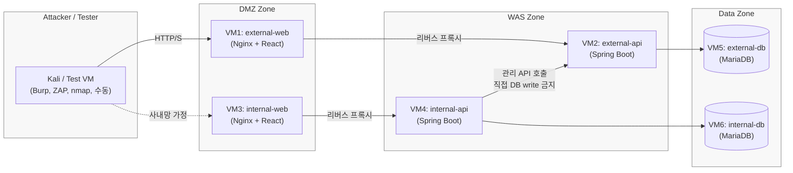
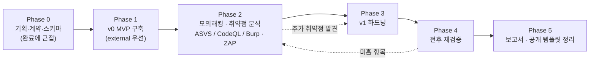
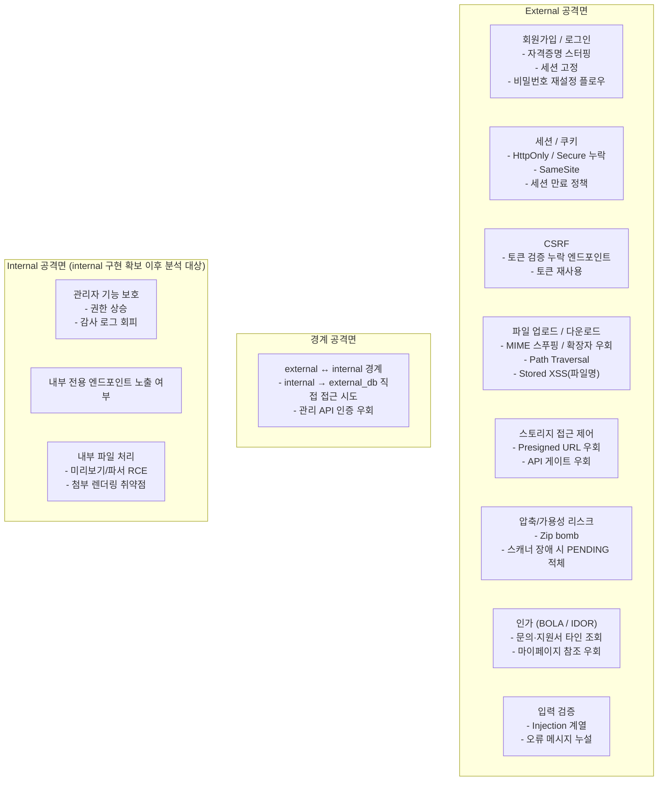

# 프로젝트 기획안

## 1. 프로젝트명

> **AI-Assisted 기업 그룹웨어 웹 인프라 대상 모의해킹 및 취약점 분석 프로젝트**
> (Pentest-Driven Hardening of an AI-Assisted Groupware Reference Stack)

---

## 2. 프로젝트 개요

본 프로젝트는 생성형 AI 보조로 빠르게 프로토타이핑한 기업 그룹웨어 웹 인프라(공개 웹 + 내부 그룹웨어)를 **모의해킹 및 취약점 분석 대상**으로 삼아, 실제 보안 리스크를 식별·분석·보완하는 전 과정을 수행한다.

프로젝트의 중심 활동은 다음 순서로 진행된다.

1. **v0 MVP 구축** — 평범한 개발자 관점에서 기능 중심의 서비스를 구축한다. 의도적 취약화도, 추가적 보안 하드닝도 하지 않는다.
2. **취약점 분석 페이즈** — 구축된 v0을 대상으로 시나리오 기반 모의해킹, ASVS 체크리스트 점검, 정적 분석(CodeQL), 수동·도구 기반 점검을 수행한다.
3. **하드닝(v1) 페이즈** — 분석 결과를 바탕으로 보안 조치를 적용하고 동일 시나리오로 재검증한다.
4. **결과물 정리** — 분석 보고서·하드닝 전후 비교 보고서·공개 가능한 레퍼런스 템플릿을 정리한다.

본 프로젝트의 중심은 **“AI 보조 방식으로 개발한 평범한 서비스에서 어떤 취약점이 실제로 발생하고, 보완 후 위험이 얼마나 줄어드는지 측정 가능한 방식으로 기록하는 것”**이다.
최종적으로는 현업 조직이 처음부터 다시 개발하지 않아도 바로 적용해 사용할 수 있는 **안전성 기준의 v1 레퍼런스 템플릿**을 배포하는 것을 목표로 한다.

---

## 3. 프로젝트 추진 배경

- 생성형 AI를 활용한 웹 서비스 프로토타이핑은 빠른 기능 구현에는 유리하지만, 인증·인가·입력 검증·파일 처리·관리자 기능 등 보안 민감 영역에서 결함이 발생할 가능성이 높다.
- 그러나 대부분의 교육용 취약 서비스는 “의도적으로 구멍을 만든 서비스”이며, 실제 현장에서 발견되는 취약점 패턴과는 결이 다르다.
- 본 프로젝트는 **의도적 취약화 대신, 평범한 기능 개발 → 모의해킹 → 보완**의 실무에 가까운 흐름을 재현함으로써, AI 보조 개발 산출물의 현실적 보안 리스크를 식별하는 실습 환경을 구축한다.

---

## 4. 프로젝트 목표

1. 공개 웹 서비스와 내부 그룹웨어로 구성된 기업형 웹 인프라를 **v0 MVP** 형태로 구축한다.
2. 구축된 v0을 대상으로 **시나리오 기반 모의해킹과 ASVS 기반 취약점 분석**을 수행한다.
3. 분석 결과를 기반으로 보안 하드닝(v1)을 적용하고, 동일 시나리오로 **전후 재검증**을 수행한다.
4. 분석·보완 과정 전체를 **공개 가능한 보고서 + 레퍼런스 템플릿**으로 정리한다.

---

## 5. 타겟 서비스 개요

대상 서비스는 **공개 웹 서비스(external) + 내부 그룹웨어(internal)** 의 이중 경계 구조를 갖는다.

### 5.1 공개 웹 서비스 (external, Phase 1 우선 구현)

일반 사용자가 접근하는 기업 외부 서비스.

- 일반 사용자 회원가입 / 로그인 / 비밀번호 재설정
- 기업 뉴스 및 공지사항
- 고객센터 문의 (파일 첨부 포함)
- 자료실 / 브로셔 다운로드
- 채용 공고 확인 및 지원서 제출
- 마이페이지 / 내 지원 내역

### 5.2 내부 그룹웨어 (internal)

임직원과 관리자가 사용하는 내부 업무 서비스. 본 기획안에서는 구조적 범위를 고정하되, Phase 1(v0 MVP)에서는 internal-web/internal-api의 로그인·대시보드 수준 **최소 골격만** 확보한다. Phase 2에서는 서비스 경계 검증에 필요한 최소 연동만 활성화하고, external 연동을 포함한 본격 기능 확장은 Phase 3 이후 단계에서 수행한다. (Phase 정의는 섹션 9 참고)

- 임직원 전용 로그인
- 사내 공지, 사원 디렉토리
- 전자결재 / 업무 게시판
- 지원자 검토 / 고객 문의 대응
- 공개 사용자 관리 / 감사 로그

#### 5.2.1 internal ↔ external 경계 원칙 (internal 연동 착수 시점에 활성화)

internal 도입 시 두 서비스 사이의 연결성·의존성을 최소화하기 위해 아래 원칙을 적용한다. Phase 1에서는 internal을 최소 골격으로 유지하고 external 연동은 두지 않는다. Phase 2에서 경계 검증을 위한 최소 연동이 시작되는 시점부터 아래 원칙을 필수로 적용한다.

- internal은 `external_db`에 **직접 JDBC 연결을 갖지 않는다.** read / write 모두 불가.
- external 데이터에 대한 모든 접근(조회·변경)은 **external-api가 제공하는 internal 전용 엔드포인트**를 통해서만 수행한다.
- 해당 엔드포인트는 사용자 세션이 아닌 **서비스 간 전용 토큰 / 서비스 계정**으로 인증한다. 사용자 인증 경로와 분리한다.
  - 적용 시점: Phase 2 최소 연동 착수 시점부터 필수 적용. (external 단독 v0 구간은 해당 없음)
- 목적: 공격 blast radius 축소(internal 침해 시 external 데이터 자동 노출 방지), 접근 제어·감사 로그 단일화, 최소 권한 유지.
- 상기 경계는 **Phase 2 모의해킹(분석)의 핵심 검증 포인트**로 취급한다. (경계 우회·서비스 토큰 탈취·내부 전용 엔드포인트 무인증 노출 시나리오 포함)

---

## 6. 시스템 아키텍처

### 6.1 계층 구성

- **DMZ / External Ingress Zone**: 외부 사용자 요청 수신. 정적 자산 서빙 + Reverse Proxy.
- **WAS Zone (External / Internal)**: 실제 비즈니스 로직. 공개용 WAS와 내부용 WAS를 분리 운영.
- **Data Zone**:
  - **DB 2개** (`external_db`, `internal_db`) — 서비스 경계 = 데이터 소유권 경계.
  - **단일 오브젝트 스토리지** (개발: 파일시스템 / Compose: MinIO / 운영: S3-호환) — 파일 바이트 저장. prefix로 논리 zone 분리 (`raw/`, `approved/`, `rejected/`).
  - 파일 메타데이터는 owner DB의 `uploaded_file` 테이블에 보관. 바이트는 DB에 저장하지 않음(BLOB 금지).
  - **오브젝트 스토리지 직접 접근 금지**: 모든 다운로드는 owner 서비스의 API 게이트를 통해서만 허용. (presigned URL을 쓰더라도 owner API가 발급·검증 주체)

### 6.2 시스템 구성도 (VM 토폴로지)

### 6.3 토폴로지 상세 정본

- VM 구성표/네트워크 규칙/재현 전략의 정본은 [ARCHITECTURE.md](ARCHITECTURE.md) 섹션 4.4를 따른다.
- 본 문서에는 기획 단계의 계층 원칙과 흐름만 유지한다.

---

## 7. MVP(v0) 보안 기준선

v0은 **“평범한 개발자가 Spring Security 기본 설정 수준에서 기능 개발에 집중한 상태”** 로 정의한다. 이는 분석 페이즈에서 다룰 공격면을 충분히 남겨두기 위한 의도된 선택이다.

### 7.1 v0 기준선 (Framework Default 수준)

- **인증**: 세션/쿠키 기반. Spring Security 기본 세션 관리 사용.
- **CSRF**: API 계약 정본([API.md](../api/API.md) 섹션 4.3) 기준으로 구현하되, v0에서는 프레임워크 기본 수준으로 운영한다.
- **보안 헤더**: 명시적 추가 설정 없음. 프레임워크 기본값에 의존.
- **Rate Limit / Brute-force 방어**: 없음.
- **입력 검증**: Bean Validation(`@Valid`) 수준의 기본 검증만.
- **파일 업로드**: 확장자 화이트리스트 수준의 최소 검증만 수행한다.
- **파일 상태 표기**: `scan_status=APPROVED`, `scan_result_code='V0_SCAN_DISABLED'` 기본값을 강제한다. (상세 전이 정본은 [ARCHITECTURE.md](ARCHITECTURE.md) 섹션 5)
- **에러 처리**: `GlobalExceptionHandler`로 포맷 통일. 메시지 상세도는 개발자 관점의 기본값.
- **로깅 / 감사**: 기본 애플리케이션 로그만. 보안 감사 로그 별도 운영 없음.
- **서비스 간 토큰**: external 단독 v0 구간에서는 미적용(내부 연동 경로 자체가 없음).

### 7.2 v0에서 “하지 않는 것”

- 의도적 취약화 (SQL Injection 직접 심기, 인증 우회 코드 삽입 등)
- 하드닝 선행 적용 (CSP, HSTS, SameSite=Strict, 세션 고정 방지 고급 설정 등)
- 파일 보안 검사 파이프라인, `raw/approved/rejected` 상태 전이, 파일 스캐너 연동

### 7.3 v1(하드닝 후) 파일 보안 카드

`v1`에서 파일 보안은 아래 카드 중 선택 적용한다.

| 카드         | 강도        | 검사 주체       | 핵심 내용                                                                              |
| ------------ | ----------- | --------------- | -------------------------------------------------------------------------------------- |
| `low`        | 낮음        | 없음            | MIME/확장자/사이즈 검증만 수행                                                         |
| `medium`     | 중간        | 없음            | DB 상태 게이트 적용(`APPROVED`만 다운로드 허용)                                        |
| `high`       | 높음 (권장) | 각 서비스 owner | external/internal이 각자 자기 파일 보안 검사를 수행하고, 정책은 공통 라이브러리 공유   |
| `high+alpha` | 선택        | 공유 워커       | 공유 파일 보안 검사 워커로 일원화(정책 일관성↑, 결합도↑). 본 프로젝트 기본 경로는 아님 |

상태 전이/다운로드 게이트의 상세 흐름은 [ARCHITECTURE.md](ARCHITECTURE.md) 섹션 5를 정본으로 따른다.

필수 안전장치:

- **fail-open 금지(fail-closed)**: `PENDING`, `SCANNING`, `FAILED`, `REJECTED`는 기본 거부.
- **다중 인스턴스 중복 처리 방지**: `FOR UPDATE SKIP LOCKED` 또는 동등한 분산 락 사용.
- **정합성 복구 잡**: 파일 이동과 DB 상태 불일치 시 재동기화 작업 필수.
- **추적 필드 강제**: `sha256`, `scan_engine`, `scanner_version`, `last_error`, `retry_count`.
- **직접 접근 금지 유지**: presigned URL도 owner API가 발급/검증 주체여야 함.

---

## 8. 기술 스택

- 기술 스택 정본은 [README.md](../../README.md) `기술 스택` 섹션을 따른다.
- 본 문서에서는 스택의 선택 근거와 단계별 도입 시점만 유지한다.
- v0에서 제외하는 하드닝 구성(스캐너 활성, 고급 헤더 정책 등)은 [SECURITY_BASELINE.md](../security/SECURITY_BASELINE.md)와 본 문서 섹션 7 기준을 따른다.

---

## 9. Phase 모델 및 진행 흐름

- **Phase 1 (v0 MVP)**: external 중심으로 기능 완성. internal은 구조만 유지(로그인 + 최소 화면).
- **Phase 2 (분석)**: v0을 freeze한 상태에서 분석 수행. 이 시점의 커밋 SHA를 보고서에 명시.
- **Phase 3 (하드닝)**: 분석 결과에 근거해 패치. 각 patch는 발견된 finding ID와 매핑.
- **Phase 4 (재검증)**: 동일 시나리오를 다시 실행하고 전후 비교 결과를 보고서의 핵심 산출물로 남긴다.
- **Phase 5 (공개)**: v1 + 보고서 + 실행 가이드를 하나의 레퍼런스 템플릿으로 묶음.

---

## 10. 공격면 및 분석 시나리오

상기 공격면은 ASVS 항목 번호와 매핑해 분석 보고서의 기준 목차로 사용한다.

---

## 11. 보안 검증 및 운영 방식

### 11.1 API 명세 관리

- OpenAPI-first. 기능 구현 전 계약 확정.
- CI에 OpenAPI lint + drift check 유지.

### 11.2 정적 분석

- GitHub CodeQL (Java, JavaScript 쿼리셋).
- GitHub Dependency Review.

### 11.3 동적 분석 / 모의해킹

- Burp Suite Community, OWASP ZAP을 attacker VM(VM7)에서 수행.
- 수동 시나리오 점검은 공격면 카탈로그(섹션 10) 기준.

### 11.4 ASVS 매핑

- v0 분석 finding을 ASVS level 1~2 항목과 매핑해 커버리지 표 작성.

### 11.5 재검증

- v1 적용 후 동일 도구·시나리오·환경에서 재수행.
- finding 별 상태 전이(open → fixed / accepted-risk / wont-fix)로 관리.

### 11.6 Production Readiness Notes

본 저장소의 실습/공개 범위는 prefix 분리(`raw/approved/rejected`)를 기본으로 한다.
다만 운영급 환경에서는 아래 항목을 추가 권장한다.

- 버킷 분리 또는 계층별 IAM 정책 분리
- prefix별 KMS 키 분리
- immutable/WORM 보관 정책(감사 로그·차단 파일)
- 스토리지 접근 로그 중앙 수집 및 이상 징후 탐지

---

## 12. 배포 및 공개 전략

| 구분        | 전략                                   |
| ----------- | -------------------------------------- |
| 실습 / 시연 | VMware 기반 6 VM(+공격자 VM) 분리 환경 |
| 재현 / 공개 | 동일 토폴로지의 Docker Compose 템플릿  |

- VMware 환경은 실제 zone 분리·방화벽 규칙 검증용.
- Docker Compose는 리뷰어가 저장소만 받아 재현할 수 있도록 하기 위한 보조 수단.

---

## 13. 산출물

최종 산출물은 다음과 같다. **분석·재검증 보고서를 1급 산출물로 둔다.**

1. **취약점 분석 보고서 (v0 대상)** — 발견 항목·재현 절차·영향도·ASVS 매핑.
2. **하드닝 보고서 (v0 → v1)** — finding별 적용한 조치와 근거.
3. **전후(before/after) 비교 보고서** — 동일 시나리오 재실행 결과, 회귀 여부 포함.
4. v0 / v1 각각의 실행 가능한 소스 스냅샷(브랜치 또는 태그).
5. 6 VM 기반 실습 환경 구성 가이드 + Docker Compose 재현 가이드.
6. 공개용 레퍼런스 템플릿(v1 기준) 및 설치/실행 문서.

---

## 14. 기대 효과

- AI 보조 개발 산출물의 현실적인 보안 리스크 패턴 데이터화.
- 기업형 웹 인프라의 경계 설계에 대한 모의해킹 경험 확보.
- ASVS 기반 취약점 분석 보고서 작성 역량 확보.
- 전후(before/after) 재검증을 포함한 실무형 보안 개선 프로세스 체득.
- 공개 템플릿 형태의 포트폴리오 산출.

---

## 15. 범위 제한 및 주의 사항

- 본 프로젝트의 모의해킹 활동은 **프로젝트가 구축한 폐쇄형 VM 환경**에서만 수행한다.
- 외부 서비스·실제 타사 자산에 대한 공격 테스트는 범위에서 제외한다.
- “테스트 페이로드” 평가 역시 승인된 폐쇄 실습 환경에서만 수행한다.

---

## 16. 결론

이 프로젝트의 핵심은 **의도적으로 취약한 서비스를 만드는 데 있지 않다. 동시에 v1 결과물을 문서로 제시하는 데서 끝나지도 않는다.**
AI 보조로 만든 현실적인 기업 웹 인프라를 대상으로 **모의해킹 → 취약점 분석 → 하드닝 → 재검증**을 수행하고, 그 과정을 측정 가능한 보고서로 남긴 뒤 재사용 가능한 v1 레퍼런스 템플릿으로 배포하는 것이 이 프로젝트의 목표다.
